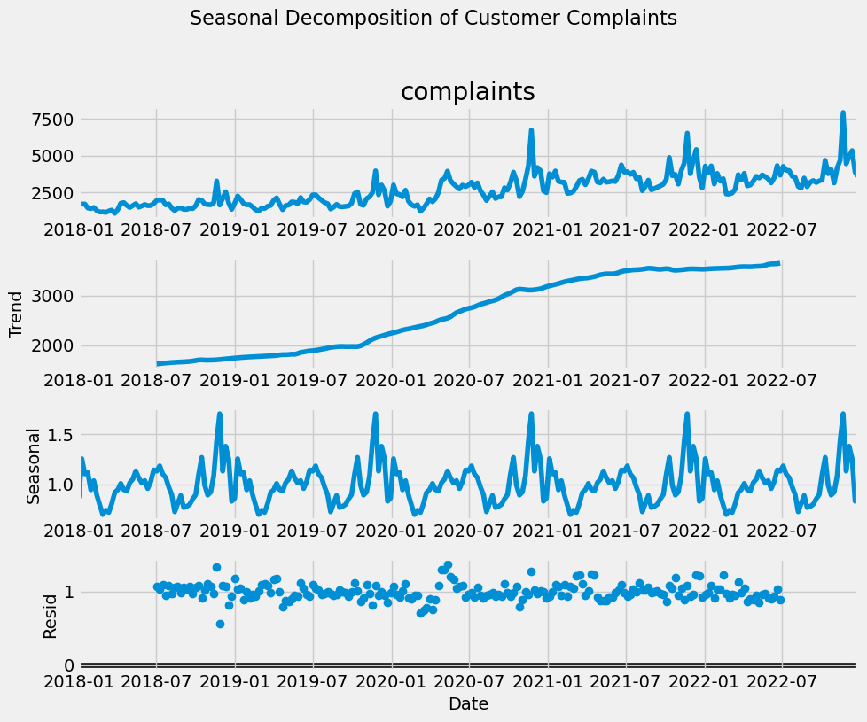
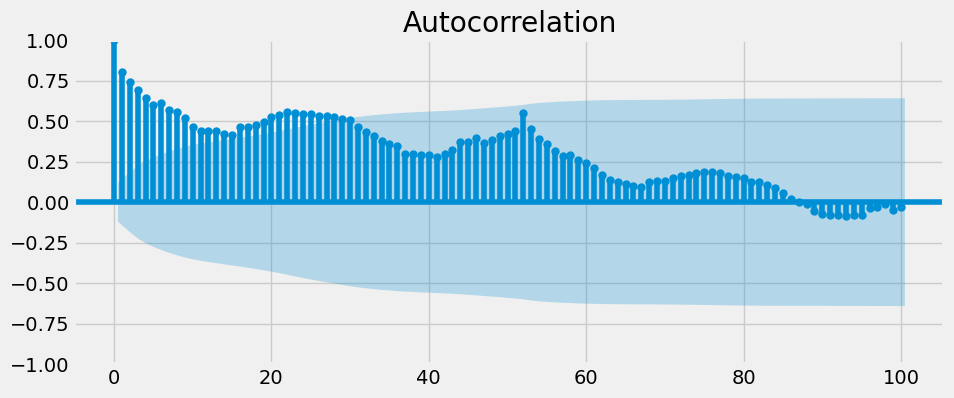
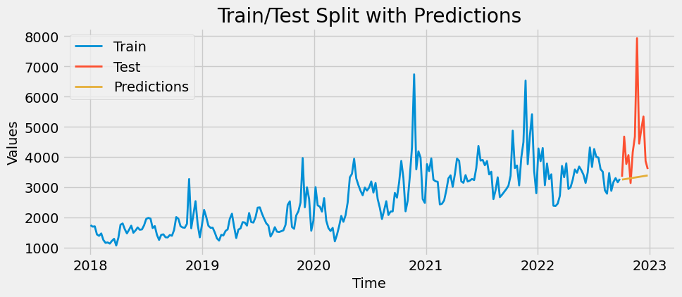
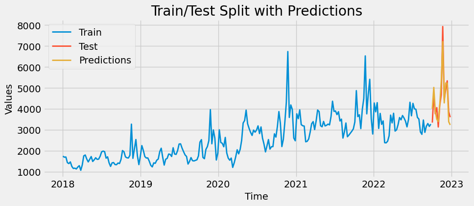
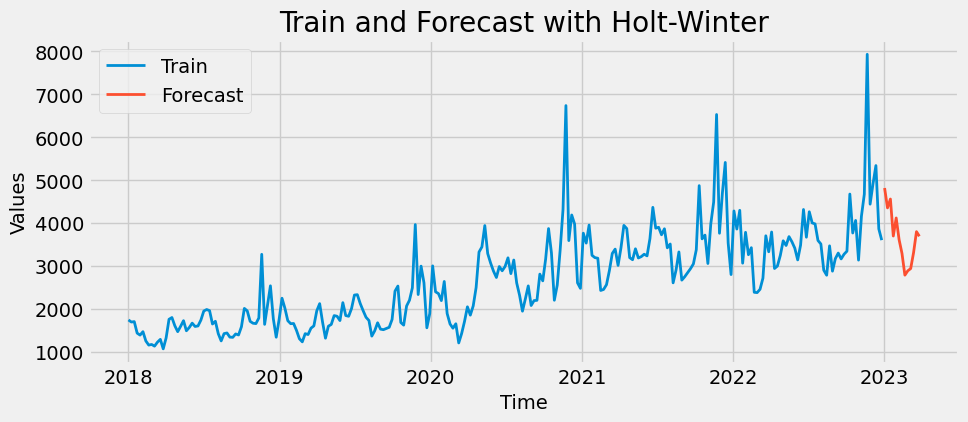

# Weekly Complaint Forecasting – Telecom Time Series Project (Python)

## Project Overview
This project focuses on forecasting weekly customer complaints for a telecom company using time series analysis. The goal is to identify complaint trends and predict future volumes to optimize resource allocation and improve customer service responsiveness. The analysis applies exponential smoothing methods and finalizes forecasting with the Holt-Winters model for enhanced accuracy.

## Business Problem
Telecom companies face fluctuating complaint volumes driven by promotions, service changes, and product launches. Without accurate forecasting, support teams risk being under- or over-staffed, leading to reduced service quality or operational inefficiencies. This project provides a data-driven solution to forecast complaint patterns and support proactive workforce management.

## Analytical Approach
The analysis applies a structured forecasting methodology using three exponential smoothing techniques:
- Simple Exponential Smoothing (SES) for baseline forecasting  
- Holt’s Linear Trend Method for trend-based forecasting  
- Holt-Winters (Triple Exponential Smoothing) to capture both trend and seasonality  

Each model was evaluated based on its ability to handle complaint variability across promotional periods and seasonal cycles.

## Key Insights

### Complaint Patterns and Seasonality
Complaint spikes align with large commercial events, highlighting the operational impact of marketing campaigns.  

Autocorrelation confirmed weekly dependency and repeating patterns.  

### Model Comparisons

#### Simple Exponential Smoothing
Provides short-term stability but underfits seasonal changes.  

#### Holt’s Linear Trend
Improves trend detection but still lacks seasonal adaptability.  

#### Holt-Winters (Triple Exponential Smoothing)
Effectively models both seasonality and trend, delivering the most accurate forecasts.  

Future projections highlight expected complaint peaks during promotion-heavy weeks.  

## Technical Implementation
Developed in Python using Pandas, NumPy, and Statsmodels for time series modeling.  
Matplotlib and Seaborn were used for visualization and diagnostic analysis.

## Conclusion
The Holt-Winters model provides the best fit for weekly complaint forecasting, capturing both trend and seasonal effects. This approach enables telecom companies to plan customer support operations efficiently, anticipate complaint surges, and align service resources with predicted demand.
